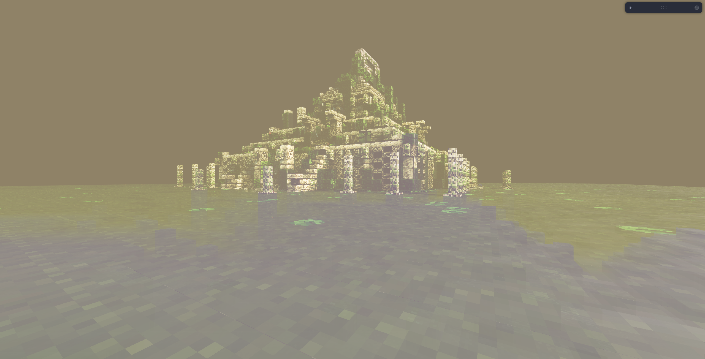

	<h1>Gradient Stylized Effect</h1>
	

		<b>A reimplementation of a Godot Shader in three.js for postprocessing gradient fog</b>
	

    <h2>Link to the Godot Shaders page: <a href="https://godotshaders.com/shader/gradient-color-fog/">Click here</a></h2>

 

# Stack 🧰

    
    
    

<a href="https://r3f-fog-effect.vercel.app/">Link to the demo</a>

